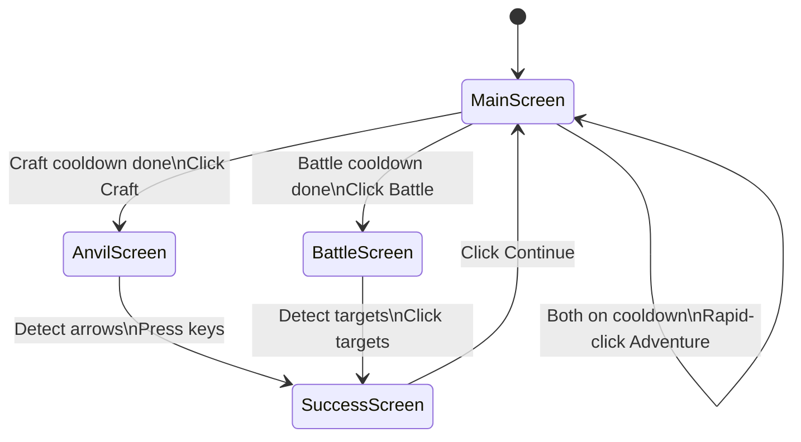

# Last Meadow Online Bot

[](https://pypi.org/project/last-meadow-online-bot/)
[](https://pypi.org/project/last-meadow-online-bot/)
[](https://pypi.org/project/last-meadow-online-bot/)
[](https://pypi.org/project/last-meadow-online-bot/)
[](https://github.com/captivus/last-meadow-online-bot/actions/workflows/publish.yml)

An automation bot for [Last Meadow Online](https://discord.com/blog/last-meadow-online-announcement), Discord's April 2026 DBMMIRPG (Discord-Based Massively Multiplayer Incremental Role Playing Game). This bot automates the full gameplay loop for the **Ranger** class with the **Crafting** skill, helping contribute damage to the community dragon boss "Grass Toucher."

I really don't get the point of this game, but I thought it would be trivial to automate it ... so I did!

There's more extension needed to fully automate the other classes that I didn't play, but I'll leave that to someone who cares to contribute.

## What It Automates

The bot runs a continuous loop across three activities:

- **Adventuring** -- rapid-clicks the Adventure button to gather resources and XP while waiting for cooldowns
- **Crafting (Smithy's Anvil)** -- uses OpenCV template matching to read the arrow key sequence displayed on screen, then presses the corresponding keys automatically
- **Battling (Ranger Archery)** -- detects the bullseye targets that appear on screen using circular blob detection and clicks them

After each craft or battle, the bot automatically clicks the Continue button on the success screen and returns to adventuring.

## Requirements

- Python 3.11+
- [uv](https://docs.astral.sh/uv/) for dependency management

### Platform Compatibility

This bot was built and tested on **Linux (X11)**. The underlying dependencies (`pynput`, `PIL.ImageGrab`, `opencv-python-headless`) are all cross-platform, so it should work on Windows and macOS with some adjustments:

| Platform | Input (`pynput`) | Screen Capture (`ImageGrab`) | Notes |
|----------|-----------------|------------------------------|-------|
| **Linux (X11)** | X11 | X11 | Tested and working |
| **Linux (Wayland)** | Requires `ydotool` | Requires alternative | Not supported as-is |
| **Windows** | Win32 API | Native | Run `--calibrate` to configure |
| **macOS** | Quartz | Native | Requires accessibility permissions (System Settings > Privacy & Security > Accessibility). Run `--calibrate` to configure. |

The bot adapts to any screen layout via its calibration wizard -- no hardcoded screen coordinates.

## Setup

```bash
git clone git@github.com:captivus/last-meadow-online-bot.git
cd last-meadow-online-bot
uv sync
```

Or install from PyPI:

```bash
uv tool install last-meadow-online-bot
```

### Calibration

Before first use, run the calibration wizard to tell the bot where your game window is:

```bash
last-meadow-online-bot --calibrate
```

The wizard walks you through 6 steps:

1. Position your mouse at the **top-left** corner of the game area, press Enter
2. Position your mouse at the **bottom-right** corner, press Enter
3. Button templates are extracted directly from your live screen
4. Detection is verified against the current screen
5. Click Craft in the game -- arrow templates are extracted from the crafting screen
6. Complete the craft -- Continue template is extracted from the success screen

Config and templates are saved to `~/.config/last-meadow-online-bot/`. You only need to calibrate once. Re-run if you move or resize the game window.

## Usage

```bash
last-meadow-online-bot
```

Or during development:

```bash
uv run last-meadow-online-bot
```

### Controls

| Key | Action |
|-----|--------|
| F8 | Start the bot |
| Escape | Pause the bot |
| Enter | Resume the bot (in terminal) |
| Ctrl+C | Quit |

## Automation Methodology

This section documents the general approach used to automate the game, including the pitfalls we encountered and how we solved them. The same methodology can be applied to automate other class/skill combinations (Paladin with shield minigame, Priest with tile-matching, etc.).

### 1. Identify Game States

The game has a finite set of screens the player moves through. Each screen has unique visual markers that distinguish it from the others. We identified these states by screenshotting each screen during gameplay:

| State | Visual Marker | How We Detect It |
|-------|--------------|-----------------|
| Main screen | Adventure/Craft/Battle buttons at the bottom | Template match on the Craft button |
| Crafting (Anvil) | Row of arrow icons in the center | Template match on arrow icons (up/down/left/right) |
| Battle (Archery) | Back button "<" in top-left, no other UI | Dark pixel check in back button region |
| Success screen | "Continue" button | Template match on Continue button |

The main screen with the three action buttons and cooldown timer:


### 2. Map the State Machine

The game follows a predictable loop. We mapped each state to the action the bot should take and which state it transitions to:



**Lesson learned -- state detection order matters.** The battle success screen still has the back button "<" visible, which is also how we detect the active battle screen. If the battle check runs before the Continue check, the bot gets stuck on the success screen thinking it's still in battle. The solution: always check for Continue *before* checking for battle in the detection order.

### 3. Extract Templates from the Live Screen

For each visual element the bot needs to recognize, the calibration wizard extracts templates directly from the user's live screen. This ensures templates match the exact resolution, aspect ratio, and rendering of the user's setup.

The crafting screen showing the arrow sequence that we extracted individual arrow templates from:


**Templates extracted during calibration:**
- `up.png`, `down.png`, `left.png`, `right.png` -- individual arrow icons, classified by direction using center-of-mass analysis
- `continue.png` -- the Continue button from the success screen
- `craft_button.png` -- the Craft button from the main screen bottom bar
- `battle_button.png` -- the Battle button from the main screen bottom bar

**Lesson learned -- always extract templates from the live screen, not reference screenshots.** Our initial approach was to ship pre-cropped templates and scale them to match the user's resolution. This failed because the game doesn't maintain a fixed aspect ratio across different window sizes -- the internal layout adapts, so templates scaled by different X and Y factors didn't match the actual rendering. Extracting fresh templates during calibration from `ImageGrab` captures solved this completely.

### 4. Define Screen Regions

Rather than scanning the entire screen every frame, we defined tight bounding boxes for each area of interest. This improves performance and reduces false positives.

Regions are stored as **relative coordinates** (fractions of the game window dimensions) and converted to absolute pixel positions at runtime using the calibrated game window bounds. The reference values below are from the original 1720x1408 development setup:

| Region | Purpose | Reference Coordinates |
|--------|---------|----------------------|
| `arrow` | Where arrow icons appear during crafting | `(0.47, 0.55, 0.23, 0.73)` |
| `continue` | Where the Continue button appears | `(0.55, 0.69, 0.35, 0.64)` |
| `craft_button` | Craft button in the bottom bar | `(0.93, 1.00, 0.64, 0.83)` |
| `craft_cooldown` | Timer text below Craft button | `(0.98, 0.99, 0.78, 0.82)` |
| `battle_button` | Battle button in the bottom bar | `(0.93, 1.00, 0.81, 0.99)` |
| `battle_cooldown` | Timer text below Battle button | `(0.98, 0.99, 0.94, 0.99)` |
| `battle_arena` | Where targets appear during battle | `(0.05, 0.90, 0.03, 0.91)` |
| `back_button` | Back button in top-left during minigames | `(0.00, 0.04, 0.00, 0.03)` |

**Lesson learned -- account for window chrome.** The game window has a title bar/tab bar at the top (32px in our setup). Our initial attempt to detect the battle score counter in the top-left failed because the coordinates were based on the game screenshot (which doesn't include the title bar), not the actual screen position. The calibration wizard handles this by having the user point at the actual game content corners.

**Lesson learned -- cooldown timer regions must be surgically precise.** Our first cooldown detection region captured part of the Craft button's border lines, which added ~7.5% dark pixels even when no timer was present. This caused the bot to think the cooldown was always active. The fix was to use a tiny region positioned entirely inside the button, below the text, where only the timer digits appear. The separation became clean: ~0% dark without timer, ~10-12% dark with timer.

### 5. Implement Detection Strategies Per Element

Different UI elements require different detection approaches:

**Template matching** (arrows, buttons) -- best for elements that appear at a consistent size and appearance. Crop a reference image, then use `cv2.matchTemplate` with `TM_CCOEFF_NORMED` and a confidence threshold (0.7).

**Pixel darkness ratio** (cooldown timers) -- best for detecting presence/absence of text in a known region. When the timer is visible, the region has ~10-18% dark pixels. When absent, ~0%. A threshold of 3% cleanly separates the two states.

**Contour-based blob detection** (battle targets) -- best for elements that change size or position. The bullseye target is circular, so we threshold the image, find contours, and filter for high circularity (>0.6), square aspect ratio, and minimum size. Detection thresholds scale proportionally with the game window size.

Battle targets appear at various positions and sizes, shrinking over time:


**Lesson learned -- UI elements create false positive targets.** Small circular elements (gear icon, decorative dots, text characters like "o") can pass the circularity filter. Three layers of defense were needed:
1. Exclude the UI corners from the battle scan area by tightening the arena region
2. Set minimum contour size high enough to filter small decorative elements while still catching real targets
3. Detect when the bot clicks the same screen position repeatedly (a real target moves after being clicked, a false positive doesn't) and treat repeated same-spot clicks as misses

### 6. Handle Timing and Transitions

Key timing considerations:
- **Adventure clicking** runs in 2-second bursts, then checks if a cooldown has finished
- **Arrow key presses** have a 50ms delay between each key
- **Battle target scanning** runs as fast as possible (~50ms per frame) to catch targets before they shrink
- **After actions** (clicking Craft, pressing arrows, clicking Continue), a 1-1.5 second delay allows screen transitions to complete
- **During battle**, the bot checks for the Continue button every ~1 second to detect when the battle ends, regardless of whether targets are being found

### 7. Adapting for Other Classes

To automate a different class or skill combination:

1. **Screenshot each new minigame screen** -- capture the unique visual elements
2. **Identify the minigame mechanic**:
   - **Paladin (Shield)** -- intercept falling projectiles by moving a shield. Would need motion tracking or rapid position detection.
   - **Priest (Tile Matching)** -- match groups of three identical tiles. Would need tile recognition and grid position mapping.
3. **Extract new templates** from live screen captures during calibration for any new UI elements
4. **Add a new state** to `detect_state()` with appropriate detection logic, being mindful of detection order to avoid state confusion
5. **Implement the minigame handler** (like `run_battle()` for archery), making sure it checks for exit conditions (Continue button) to avoid getting stuck
6. **Add new relative regions** to `config.py` if the minigame uses different areas of the screen

The shared elements (Adventure button, cooldown detection, Continue button, state machine loop) remain the same across all class/skill combinations.

## Reference Screenshots

These screenshots were captured during development to identify screen regions, extract templates, and calibrate detection thresholds.

### Main Screen (adventuring)

The Adventure button is being clicked to grind resources while cooldowns are active.


### Craft Success

After completing the arrow sequence, the success screen appears. The bot clicks Continue to return to the main screen. The battle success screen looks identical in layout.


### Battle Success

After hitting all 10 targets, the battle success screen appears with the same Continue button.


## Display Configuration

The bot uses a calibration system to adapt to any screen layout:

1. **Relative coordinates** -- all UI regions are stored as fractions of the game window dimensions, not absolute pixel values. At runtime they're converted to screen pixels using the calibrated game bounds.
2. **Live template extraction** -- during calibration, templates are captured directly from the user's screen at their native resolution and aspect ratio. No scaling or interpolation is needed.
3. **Proportional thresholds** -- detection thresholds (e.g., minimum target size for battle) scale with the game window dimensions so they work at any resolution.

Config is stored at `~/.config/last-meadow-online-bot/`. Re-run `last-meadow-online-bot --calibrate` if your game window changes.

## Dependencies

- `opencv-python-headless` -- template matching and contour detection
- `pillow` -- screen capture
- `pynput` -- keyboard and mouse input simulation
