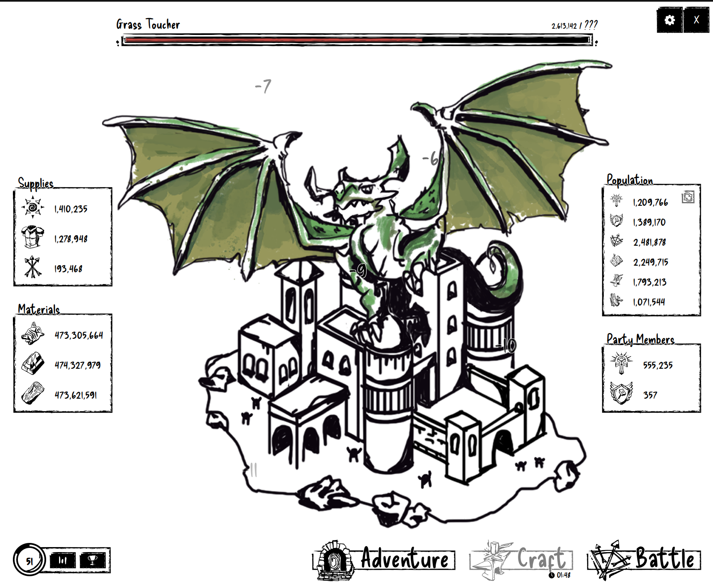
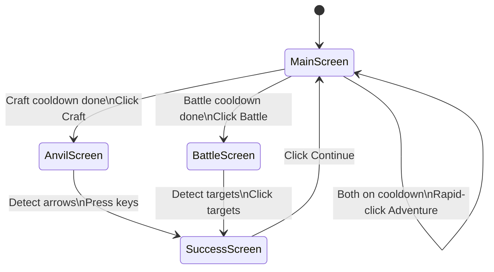
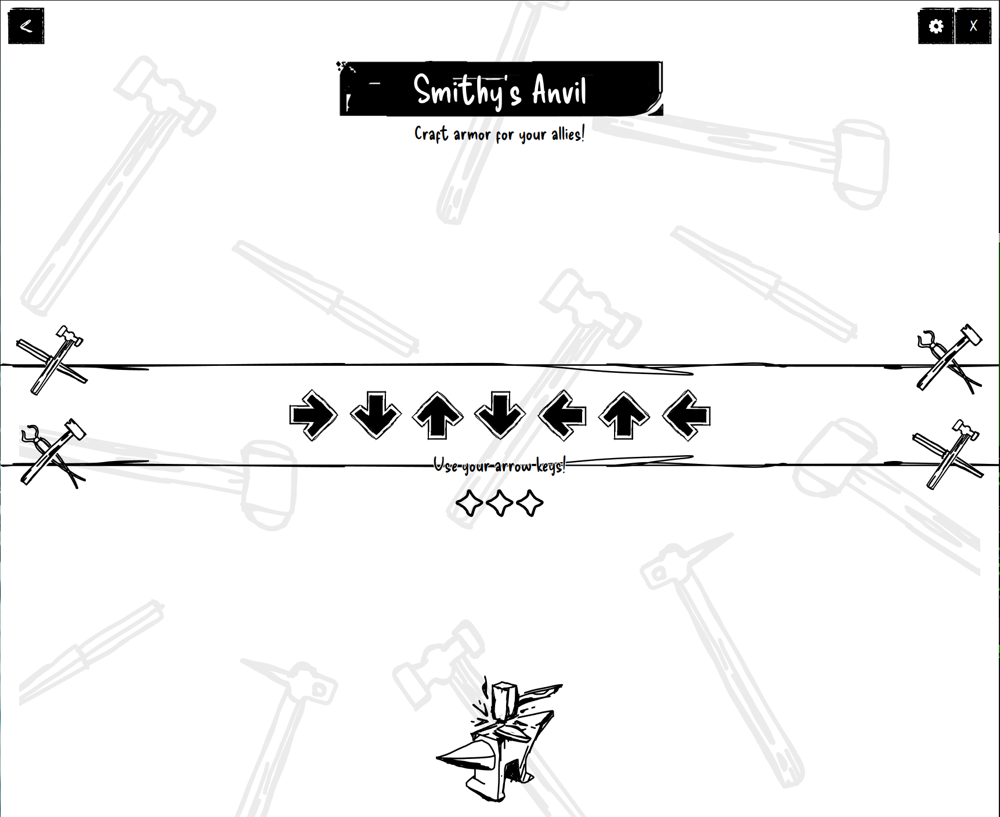
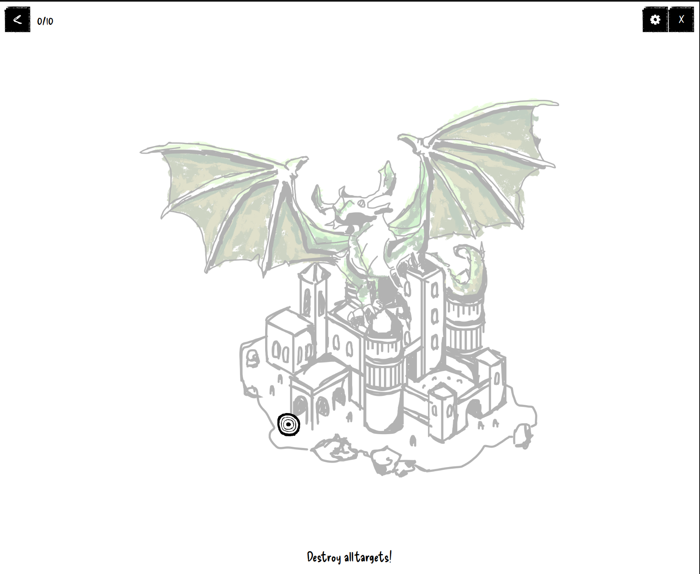
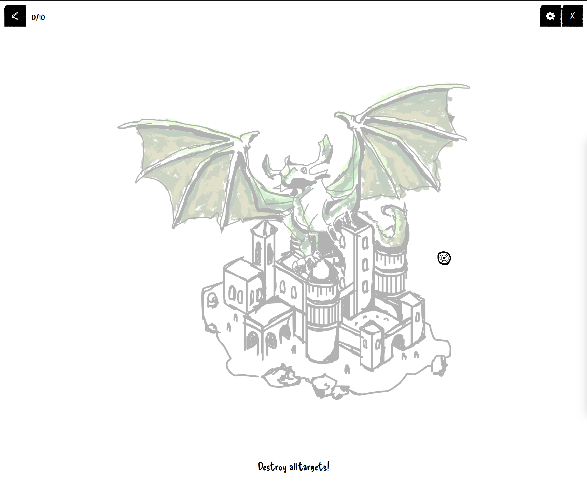
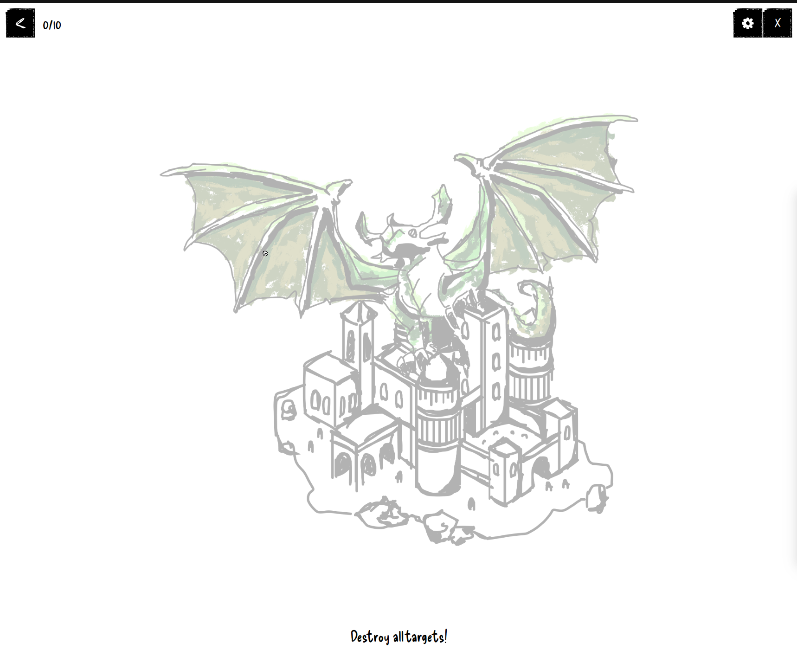
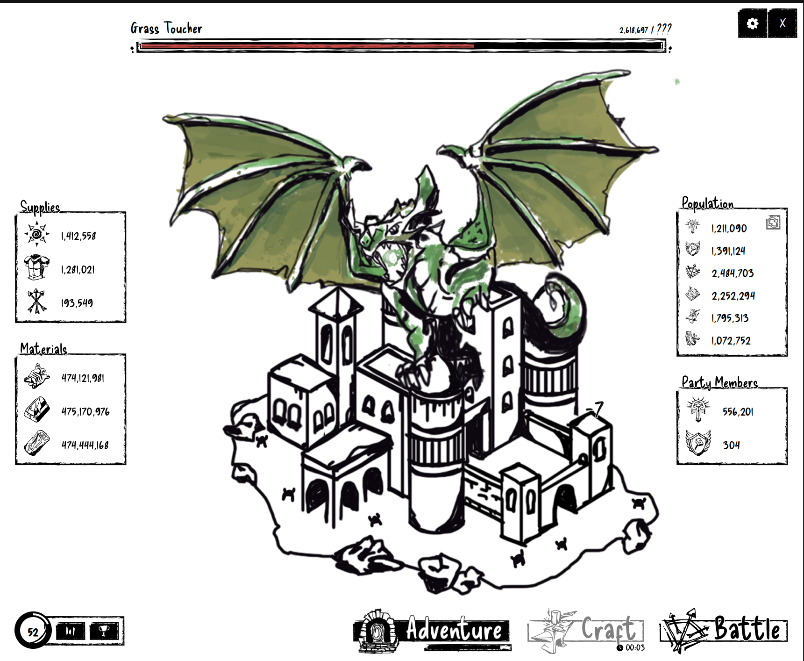
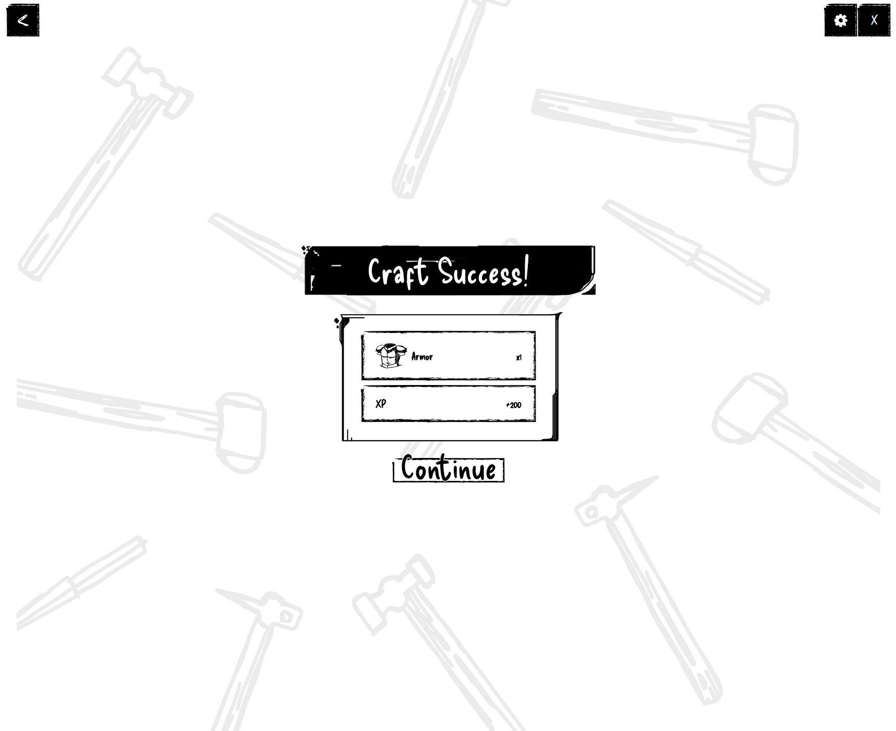
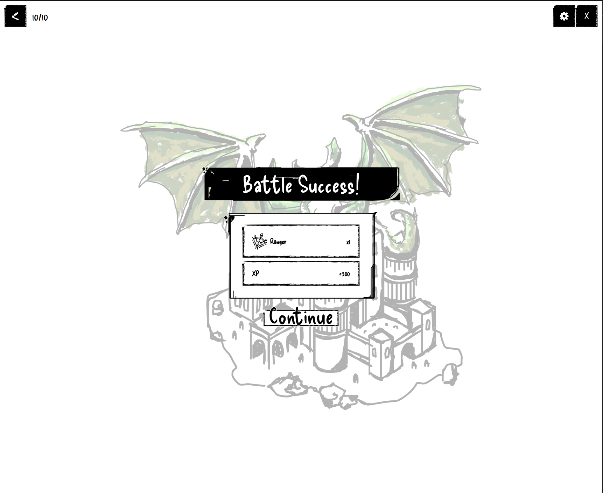

# Last Meadow Online Bot

[](https://pypi.org/project/last-meadow-online-bot/)
[](https://pypi.org/project/last-meadow-online-bot/)
[](https://pypi.org/project/last-meadow-online-bot/)
[](https://pypi.org/project/last-meadow-online-bot/)
[](https://github.com/captivus/last-meadow-online-bot/actions/workflows/publish.yml)

An automation bot for [Last Meadow Online](https://discord.com/blog/last-meadow-online-announcement), Discord's April 2026 DBMMIRPG (Discord-Based Massively Multiplayer Incremental Role Playing Game). This bot automates the full gameplay loop for the **Ranger** class with the **Crafting** skill, helping contribute damage to the community dragon boss "Grass Toucher."

I really don't get the point of this game, but I thought it would be trivial to automate it ... so I did!

There's more extension needed to fully automate the other classes that I didn't play, but I'll leave that to someone who cares to contribute.

## What It Automates

The bot runs a continuous loop across three activities:

- **Adventuring** -- rapid-clicks the Adventure button to gather resources and XP while waiting for cooldowns
- **Crafting (Smithy's Anvil)** -- uses OpenCV template matching to read the arrow key sequence displayed on screen, then presses the corresponding keys automatically
- **Battling (Ranger Archery)** -- detects the bullseye targets that appear on screen using circular blob detection and clicks them

After each craft or battle, the bot automatically clicks the Continue button on the success screen and returns to adventuring.

## Requirements

- Python 3.11+
- [uv](https://docs.astral.sh/uv/) for dependency management
- Game running on the left half of a 3440x1440 display

### Platform Compatibility

This bot was built and tested on **Linux (X11)**. The underlying dependencies (`pynput`, `PIL.ImageGrab`, `opencv-python-headless`) are all cross-platform, so it should work on Windows and macOS with some adjustments:

| Platform | Input (`pynput`) | Screen Capture (`ImageGrab`) | Notes |
|----------|-----------------|------------------------------|-------|
| **Linux (X11)** | X11 | X11 | Tested and working |
| **Linux (Wayland)** | Requires `ydotool` | Requires alternative | Not supported as-is |
| **Windows** | Win32 API | Native | Recalibrate screen regions |
| **macOS** | Quartz | Native | Requires accessibility permissions (System Settings > Privacy & Security > Accessibility). Retina displays capture at 2x resolution, so all coordinates and templates would need to be doubled or captures downscaled. |

Regardless of platform, all screen region coordinates and templates are calibrated for a specific display setup (3440x1440, game on left half). Any different display configuration requires recalibration -- see [Display Configuration](#display-configuration).

## Setup

```bash
git clone <repo-url>
cd last-meadow-online-bot
uv sync
```

## Usage

```bash
uv run last-meadow-online-bot
```

Or install globally and run directly:

```bash
uv tool install last-meadow-online-bot
last-meadow-online-bot
```

### Controls

| Key | Action |
|-----|--------|
| F8 | Start the bot |
| Escape | Pause the bot |
| Enter | Resume the bot (in terminal) |
| Ctrl+C | Quit |

## Automation Methodology

This section documents the general approach used to automate the game, including the pitfalls we encountered and how we solved them. The same methodology can be applied to automate other class/skill combinations (Paladin with shield minigame, Priest with tile-matching, etc.).

### 1. Identify Game States

The game has a finite set of screens the player moves through. Each screen has unique visual markers that distinguish it from the others. We identified these states by screenshotting each screen during gameplay:

| State | Visual Marker | How We Detect It |
|-------|--------------|-----------------|
| Main screen | Adventure/Craft/Battle buttons at the bottom | Template match on the Craft button |
| Crafting (Anvil) | Row of arrow icons in the center | Template match on arrow icons (up/down/left/right) |
| Battle (Archery) | Back button "<" in top-left, no other UI | Dark pixel check in back button region |
| Success screen | "Continue" button | Template match on Continue button |

The main screen with the three action buttons and cooldown timer:



### 2. Map the State Machine

The game follows a predictable loop. We mapped each state to the action the bot should take and which state it transitions to:



**Lesson learned -- state detection order matters.** The battle success screen still has the back button "<" visible, which is also how we detect the active battle screen. If the battle check runs before the Continue check, the bot gets stuck on the success screen thinking it's still in battle. The solution: always check for Continue *before* checking for battle in the detection order.

### 3. Extract Templates from Screenshots

For each visual element the bot needs to recognize, we captured screenshots of the game and cropped individual templates. These templates are stored in `templates/` and used for OpenCV `matchTemplate` operations.

The crafting screen showing the arrow sequence that we extracted individual arrow templates from:



**Templates extracted:**
- `up.png`, `down.png`, `left.png`, `right.png` -- individual arrow icons from the crafting screen
- `continue.png` -- the Continue button from the success screen
- `craft_button.png` -- the Craft button from the main screen bottom bar
- `battle_button.png` -- the Battle button from the main screen bottom bar

**Process for extracting templates:**
1. Screenshot the game in each state
2. Use OpenCV contour detection to find bounding boxes of UI elements
3. Crop each element with a small padding
4. Verify the template matches correctly against the live screen using `matchTemplate`

**Lesson learned -- extract templates from the live screen, not reference screenshots.** Our initial arrow templates were cropped from a high-resolution screenshot the game provided. When we ran template matching against the actual screen capture (via `ImageGrab`), the match confidence was poor because the resolutions differed slightly (1718x1403 screenshot vs 1720x1440 live capture). Re-extracting templates from a live `ImageGrab` screenshot fixed the issue.

### 4. Define Screen Regions

Rather than scanning the entire screen every frame, we defined tight bounding boxes for each area of interest. This improves performance and reduces false positives.

Regions are defined as `(y1, y2, x1, x2)` tuples in screen coordinates:

| Region | Purpose | Coordinates |
|--------|---------|-------------|
| `ARROW_REGION` | Where arrow icons appear during crafting | `(690, 810, 400, 1250)` |
| `CONTINUE_REGION` | Where the Continue button appears | `(800, 1000, 600, 1100)` |
| `CRAFT_BUTTON_REGION` | Craft button in the bottom bar | `(1340, 1440, 1100, 1420)` |
| `CRAFT_COOLDOWN_REGION` | Timer text below Craft button | `(1408, 1425, 1335, 1405)` |
| `BATTLE_BUTTON_REGION` | Battle button in the bottom bar | `(1340, 1440, 1400, 1700)` |
| `BATTLE_COOLDOWN_REGION` | Timer text below Battle button | `(1405, 1425, 1620, 1700)` |
| `BATTLE_ARENA_REGION` | Where targets appear during battle | `(100, 1300, 60, 1560)` |
| `BACK_BUTTON_REGION` | Back button in top-left during minigames | `(35, 90, 5, 60)` |

**All coordinates assume the game is running on the left half of a 3440x1440 display (1720x1440 game window).**

**Lesson learned -- account for window chrome.** The game window has a 32px title bar/tab bar at the top. Our initial attempt to detect the battle score counter ("0/10") in the top-left failed because the coordinates were based on the game screenshot (which doesn't include the title bar), not the actual screen position. Always verify regions against live `ImageGrab` captures, not standalone screenshots.

**Lesson learned -- cooldown timer regions must be surgically precise.** Our first cooldown detection region captured part of the Craft button's border lines, which added ~7.5% dark pixels even when no timer was present. This caused the bot to think the cooldown was always active. The fix was to use a tiny region (`1408, 1425, 1335, 1405`) positioned entirely inside the button, below the text, where only the timer digits appear. The separation became clean: ~0% dark without timer, ~10-12% dark with timer.

### 5. Implement Detection Strategies Per Element

Different UI elements require different detection approaches:

**Template matching** (arrows, buttons) -- best for elements that appear at a consistent size and appearance. Crop a reference image, then use `cv2.matchTemplate` with `TM_CCOEFF_NORMED` and a confidence threshold (0.7).

**Pixel darkness ratio** (cooldown timers) -- best for detecting presence/absence of text in a known region. When the timer is visible, the region has ~10-18% dark pixels. When absent, ~0%. A threshold of 3% cleanly separates the two states.

**Contour-based blob detection** (battle targets) -- best for elements that change size or position. The bullseye target is circular, so we threshold the image, find contours, and filter for high circularity (>0.6), square aspect ratio, and minimum size (10px). This detects targets from 32px down to about 12px diameter.

Battle targets appear at various positions and sizes, shrinking over time:







**Lesson learned -- UI elements create false positive targets.** The settings gear icon in the top-right corner has a small circular sub-element (8x8px, circularity 0.86) that passed our target filter. Similarly, the battle success screen has small circular decorative elements (~9px) that kept triggering false detections, preventing the battle loop from exiting. Two fixes were needed:
1. Exclude the UI corners from the battle scan area by tightening `BATTLE_ARENA_REGION`
2. Increase the minimum contour size from 5px to 10px (area from 20 to 50), which filtered out these false positives while still detecting real targets (32px+)

### 6. Handle Timing and Transitions

Key timing considerations:
- **Adventure clicking** runs in 2-second bursts, then checks if a cooldown has finished
- **Arrow key presses** have a 50ms delay between each key
- **Battle target scanning** runs as fast as possible (~50ms per frame) to catch targets before they shrink
- **After actions** (clicking Craft, pressing arrows, clicking Continue), a 1-1.5 second delay allows screen transitions to complete
- **During battle**, the bot checks for the Continue button every ~1 second to detect when the battle ends, regardless of whether targets are being found

### 7. Adapting for Other Classes

To automate a different class or skill combination:

1. **Screenshot each new minigame screen** -- capture the unique visual elements
2. **Identify the minigame mechanic**:
   - **Paladin (Shield)** -- intercept falling projectiles by moving a shield. Would need motion tracking or rapid position detection.
   - **Priest (Tile Matching)** -- match groups of three identical tiles. Would need tile recognition and grid position mapping.
3. **Extract new templates** from live screen captures (not standalone screenshots) for any new UI elements
4. **Add a new state** to `detect_state()` with appropriate detection logic, being mindful of detection order to avoid state confusion
5. **Implement the minigame handler** (like `run_battle()` for archery), making sure it checks for exit conditions (Continue button) to avoid getting stuck
6. **Adjust screen regions** if the minigame uses different areas of the screen, verifying against live captures and accounting for window chrome

The shared elements (Adventure button, cooldown detection, Continue button, state machine loop) remain the same across all class/skill combinations.

## Reference Screenshots

These screenshots were captured during development to identify screen regions, extract templates, and calibrate detection thresholds.

### Main Screen (adventuring)

The Adventure button is being clicked to grind resources while cooldowns are active.



### Craft Success

After completing the arrow sequence, the success screen appears. The bot clicks Continue to return to the main screen. The battle success screen looks identical in layout.



### Battle Success

After hitting all 10 targets, the battle success screen appears with the same Continue button.



## Display Configuration

The bot is configured for a game window occupying the left half of a 3440x1440 display (1720x1440 game window). If your setup differs, you'll need to:

1. **Re-measure screen regions** -- all `*_REGION` constants at the top of `main.py` are pixel coordinates. Capture a screenshot using `ImageGrab.grab()` (not the game's own screenshot feature) and measure the bounding boxes for each UI element. Be aware of any title bar or window chrome offset.
2. **Re-extract templates** -- crop fresh arrow, button, and Continue templates from your live screen captures and save them to `templates/`. Template sizes must match what `ImageGrab` captures, not what the game renders internally.
3. **Update button center coordinates** -- `ADVENTURE_BUTTON_X/Y` and `BATTLE_BUTTON_X/Y` are absolute screen coordinates for click targets.

## Dependencies

- `opencv-python-headless` -- template matching and contour detection
- `pillow` -- screen capture
- `pynput` -- keyboard and mouse input simulation
